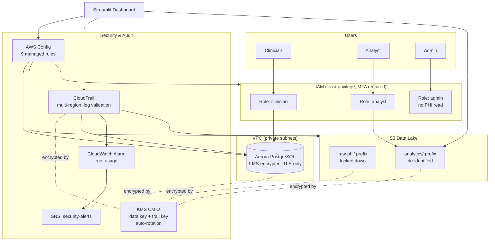

# Architecture — Secure Healthcare Data Management & Analytics Platform

## Goals

1. Store structured healthcare records (Aurora) and bulk/raw data (S3) with **encryption at rest and in transit**.
2. Enforce **least-privilege, role-based access** (clinician / analyst / admin) via IAM.
3. Continuously **monitor configuration for compliance drift** with AWS Config.
4. Maintain a **tamper-evident audit trail** of every API call with CloudTrail.
5. Provide a **dashboard** for analytics on de-identified data and for viewing security/compliance posture.

## Diagram (Mermaid — paste into https://mermaid.live or a draw.io Mermaid import)

## Component detail

| Component | Purpose | Key security controls |
|---|---|---|
| **Aurora PostgreSQL** | System of record for patient & encounter data | Private subnets only, `storage_encrypted=true` with CMK, `rds.force_ssl=1`, 14-day backups, deletion protection, Performance Insights encrypted |
| **S3 data lake** | Bulk storage: raw PHI (`raw-phi/`) and de-identified analytics extracts (`analytics/`) | SSE-KMS by default, bucket policy denies unencrypted uploads and non-TLS requests, versioning, public access fully blocked, access logging to a separate bucket |
| **KMS** | Encryption key management | Two CMKs (data, CloudTrail) so log-tampering requires a different key than data access; annual automatic rotation |
| **IAM** | Access control | Three roles with explicit `Deny` statements for separation of duties; MFA required to assume any role; account-wide 14-char password policy with 90-day rotation |
| **AWS Config** | Continuous compliance monitoring | 9 managed rules covering encryption, public access, MFA, password policy, CloudTrail status, KMS rotation |
| **CloudTrail** | Audit trail | Multi-region trail, log file validation (tamper-evidence), S3 data-event logging on the PHI bucket, CloudWatch Logs integration, alarm + SNS topic on root-account usage |
| **Dashboard** | Visualization | Reads Config compliance + CloudTrail events + de-identified analytics data only; its IAM role cannot read raw PHI or modify infrastructure |

## Data flow

1. Clinicians authenticate (MFA) and assume the `clinician` role to read/write encounter records directly in Aurora.
2. A batch/ETL job (not included — see "Extending this project" in the README) periodically de-identifies data and writes extracts to `s3://.../analytics/` for analysts.
3. Analysts assume the `analyst` role, which can only read the `analytics/` prefix — the `raw-phi/` prefix is explicitly denied.
4. Every API call (console, CLI, SDK) is captured by CloudTrail; AWS Config snapshots resource configuration and evaluates it against the 9 rules on every change.
5. The dashboard (running under its own restricted instance role) queries Config and CloudTrail for the Security & Compliance and Audit Log views, and reads only the `analytics/` data for the BI views.

## HIPAA Security Rule mapping

See the "Security & Compliance" tab in the dashboard for a live-rendered version of this table, or `README.md` for the full list.
